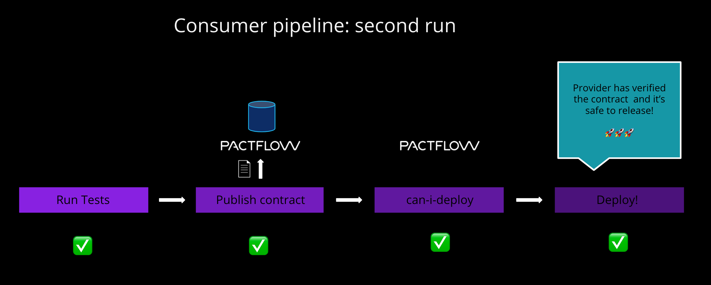
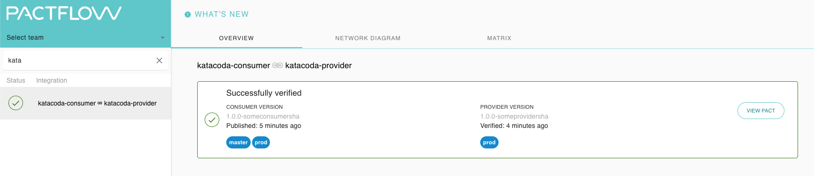

# Deploy the consumer

Now that the provider is in production, and has satisfied the needs of the consumer, we can once again check if it's safe to release the consumer by running `npm run can-deploy:consumer`{{execute}}

This should now pass:

```
> npx pact-broker can-i-deploy --pacticipant katacoda-consumer --version 1.0.0-someconsumersha --to prod

Computer says yes \o/

CONSUMER          | C.VERSION             | PROVIDER          | P.VERSION             | SUCCESS?
------------------|-----------------------|-------------------|-----------------------|---------
katacoda-consumer | 1.0.0-someconsumersha | katacoda-provider | 1.0.0-someprovidersha | true

All required verification results are published and successful
```

Now we may release our consumer application to production: `npm run deploy:consumer`{{execute}}



## Check

Your dashboard should look something like this, where both your consumer and provider are marked as having been deployed to `prod`:

